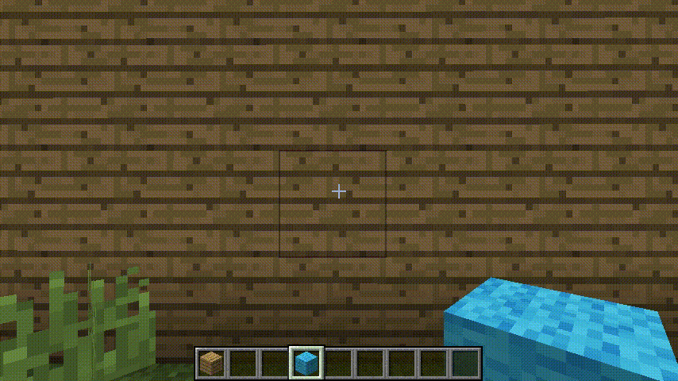

# LotTweaks for MineCraft 1.12.2

LotTweaks は建築補助を目的としたクリエイティブモード向けMODです。

"LotTweaks" adds some tweaks for builders to increase productivity in Creative mode.

## 追加されるキー / Keys

### 'Ex Pick' key (Client)

- 長距離のPick (100ブロック以上)
/ Extended 'Pick block' (up to 100+ blocks away)
- 長押し + マウスホイール で隣接ブロックのPickも可能です。
/ long press + wheel to pick 'near' blocks

### 'Rotate' key (Client)

- 手持ちブロックを同じグループの別ブロックで置き換えます。
/ swap the current block to next block in the same block-group.
- グループはconfigで設定するか、 `/lottweaks add` コマンド（下記）で追加します。
/ block-groups can be determined by a config or added by `/lottweaks add` command.
- 操作方法: 長押し + マウスホイール
/ long press + wheel

### 'Replace' key (Client + *Server* )

- 視線の先にあるブロックを手持ちブロックで置換します。
- マルチでこの機能を使うには、サーバ側にもLotTweaksの導入が必要です。

## コマンド / Commands

### `/lottweaks add` command (Client)

- ホットバー内のブロックを左から順にグループとして登録します。
- 最大で9ブロックまでを一度に登録できます。
- `add` は省略できません。
- 試験的機能のため、Configファイルのバックアップを推奨します。
- [How to use](https://twitter.com/LOTqwerty/status/1312584389675552768)

## ブロックグループについて

- 1つのブロックは1つのグループのみに所属できます。複数グループには所属できません。
- アイテムは登録できません。
- configでは `ブロック名/メタ` の形式で、カンマ `,` 区切りで記述します。
- メタ0番の場合はメタを省略し、ブロック名のみで登録できます。

例: ガラスブロック(メタ0)、本棚(メタ0)、土(メタ1)を登録するときは、 `minecraft:glass,minecraft:bookshelf,minecraft:glass,minecraft:dirt/1`

## 導入方法 / How to install

Forge 1.12.2 - 14.23.5.2854 を導入後、modsフォルダに入れてください。 / Requires MinecraftForge 1.12.2 - 14.23.5.2854

## ダウンロード / Download

*必ず事前の&定期的なバックアップを実施してください。*

*本MODの使用またはその他の扱いによって生じるあらゆる事柄について、作者は責任を負わないものとします。*

[上記に同意の上、ダウンロードする / Accept the disclaimer above and download](https://drive.google.com/drive/folders/15P4FLZgDrP7vwP9E47XhJRwj71IVASuc)

## 更新履歴

WIP

